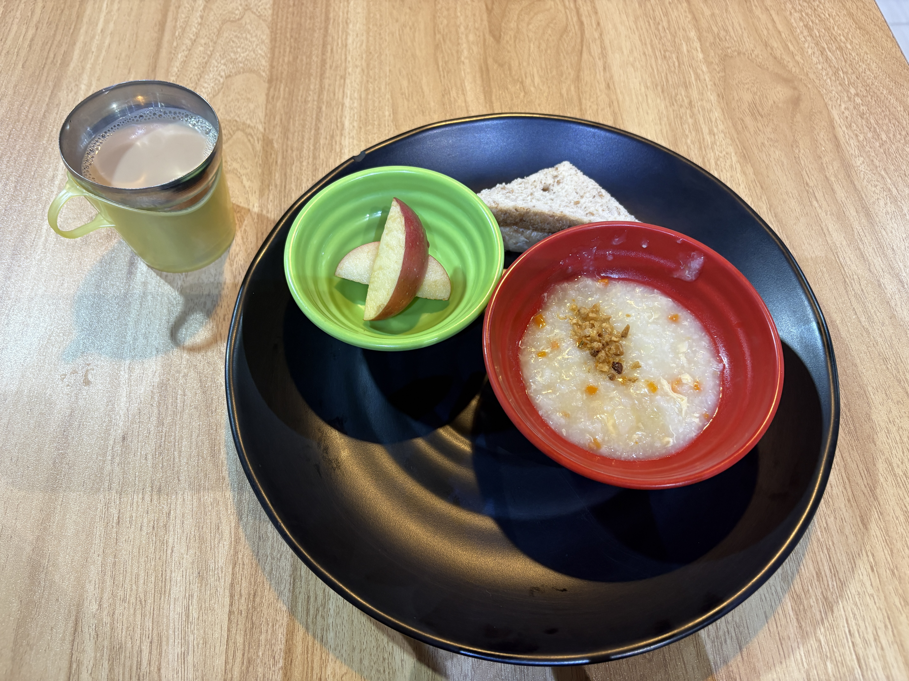
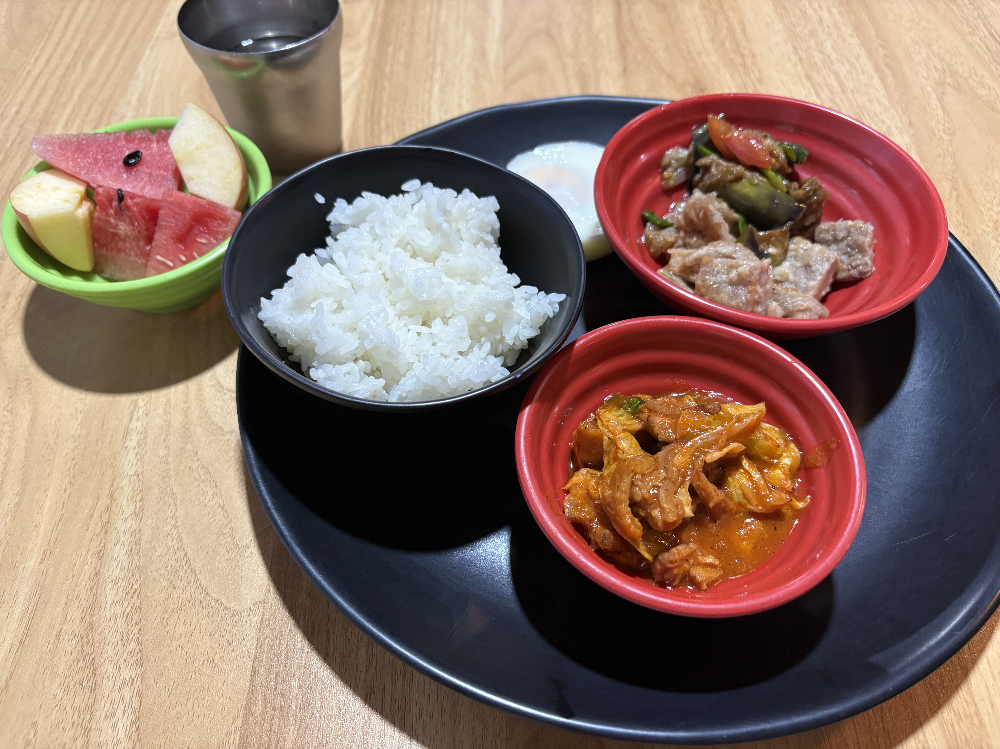
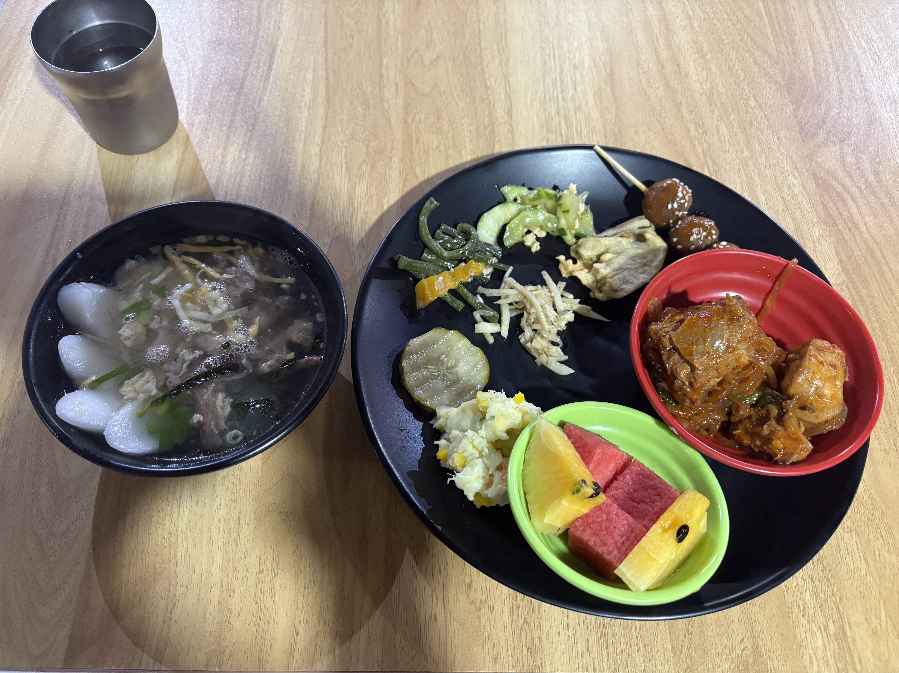

I joined the Lantern Festival during lunchtime today.

I took part in a game where we had to hold a spoon in our mouths and balance a small piece of fruit on it while carrying it.  
We were in groups of five.

It was a little embarrassing to do it in front of all the students and teachers, but it was fun!

  
Meals

  
Original

I joind Lantern Festival during the lunch time.  
I prayed a game with a group of five person that I held a spoon in my mouth, and carry a small fruit on them.  
I felt a little embarrassed to do in the front of students and teachers.

  
Fixed

I joined the Lantern Festival during lunchtime.

I played a game in a group of five people.  
We had to hold a spoon in our mouths and carry a small piece of fruit on it.

I felt a little embarrassed to do it in front of the students and teachers.

