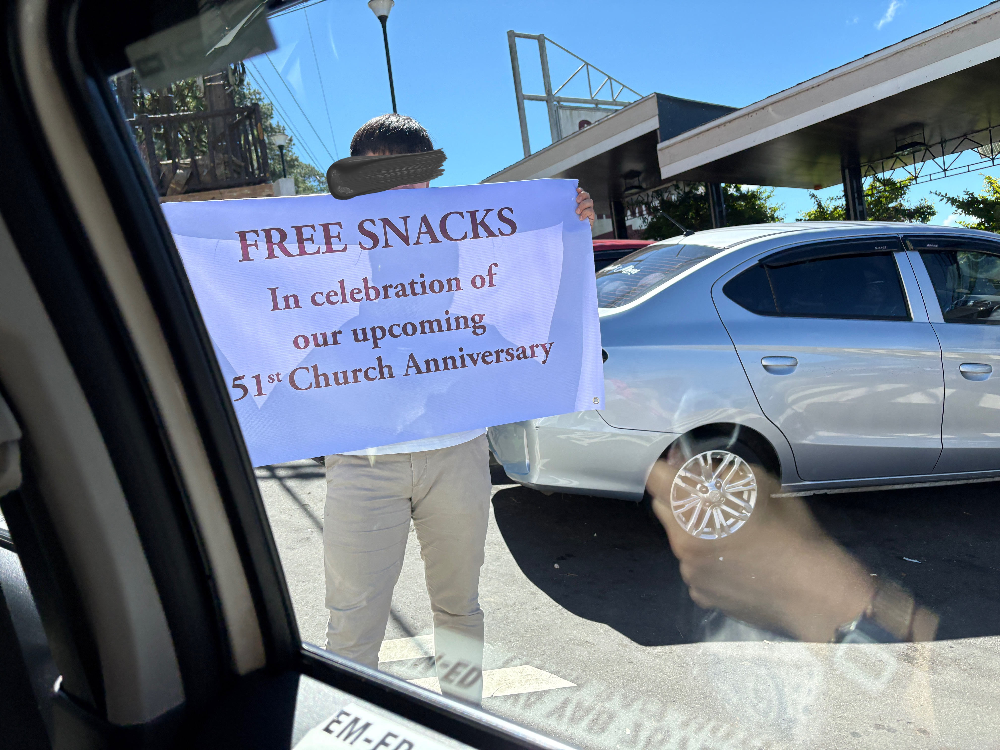
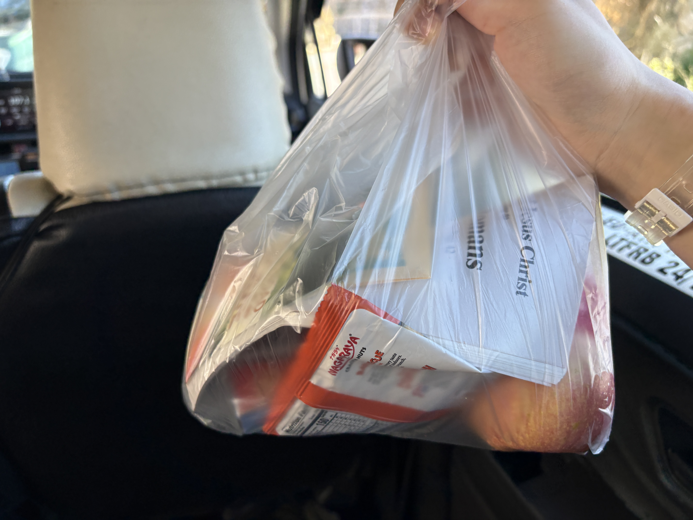
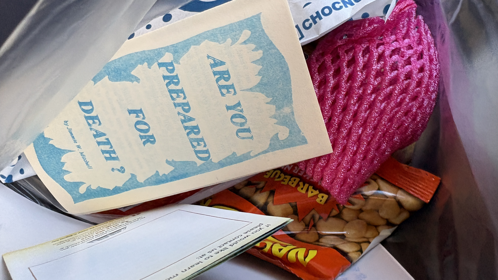
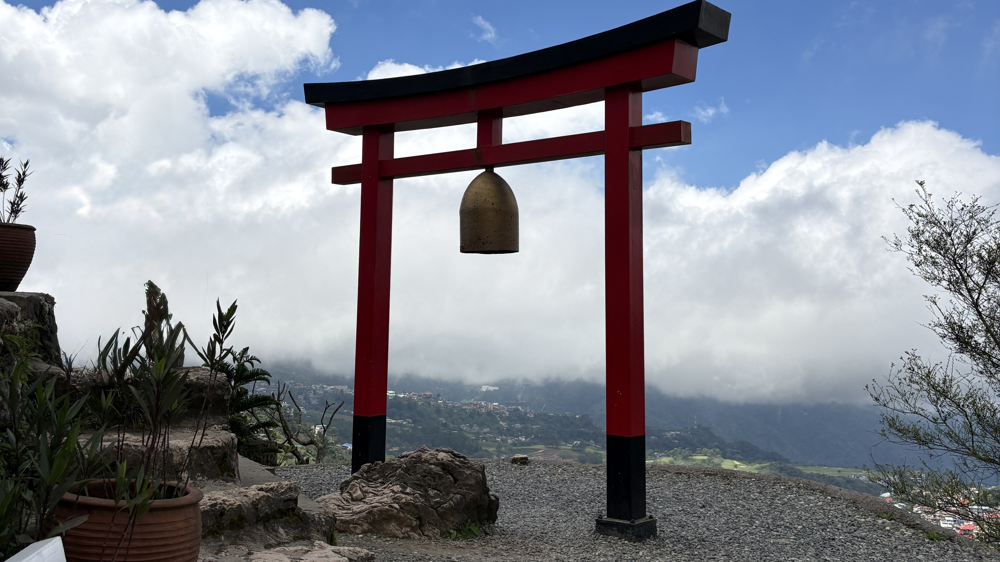
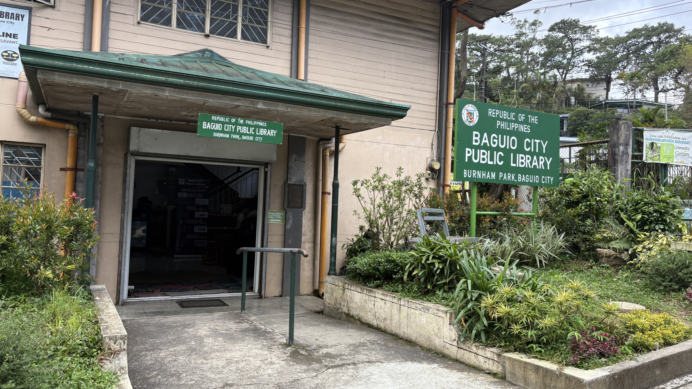
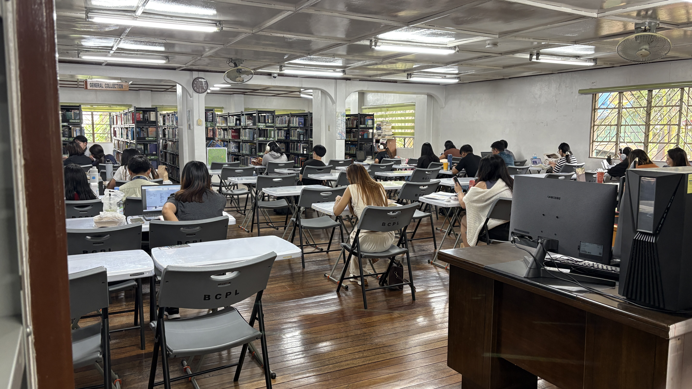
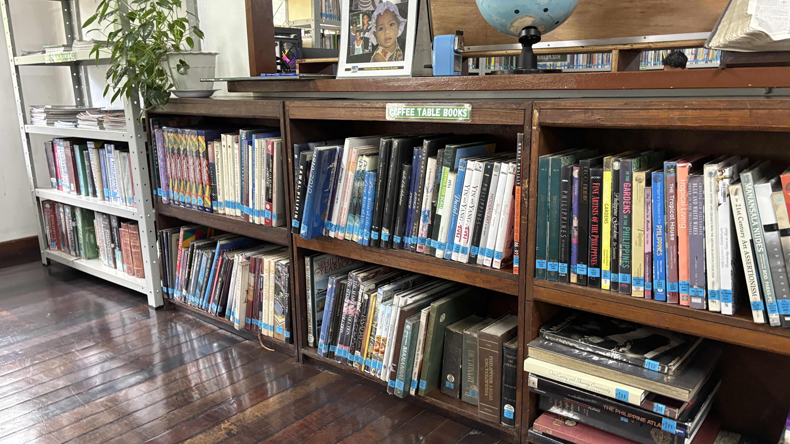
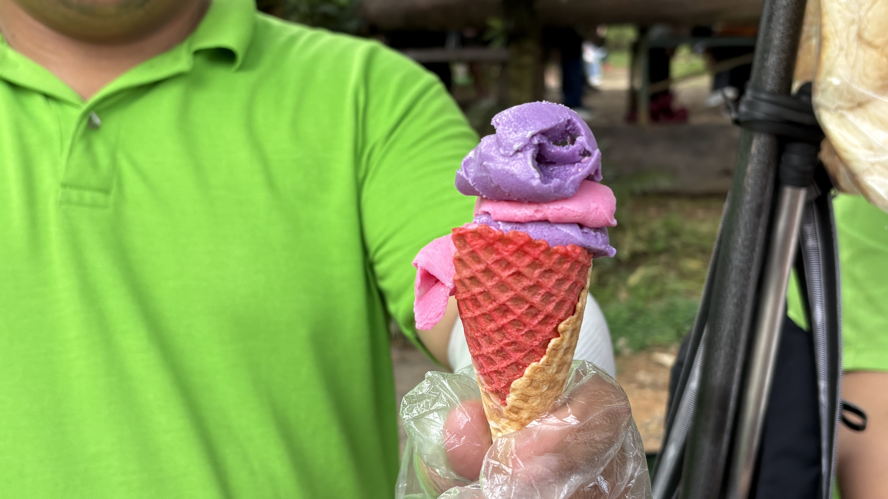
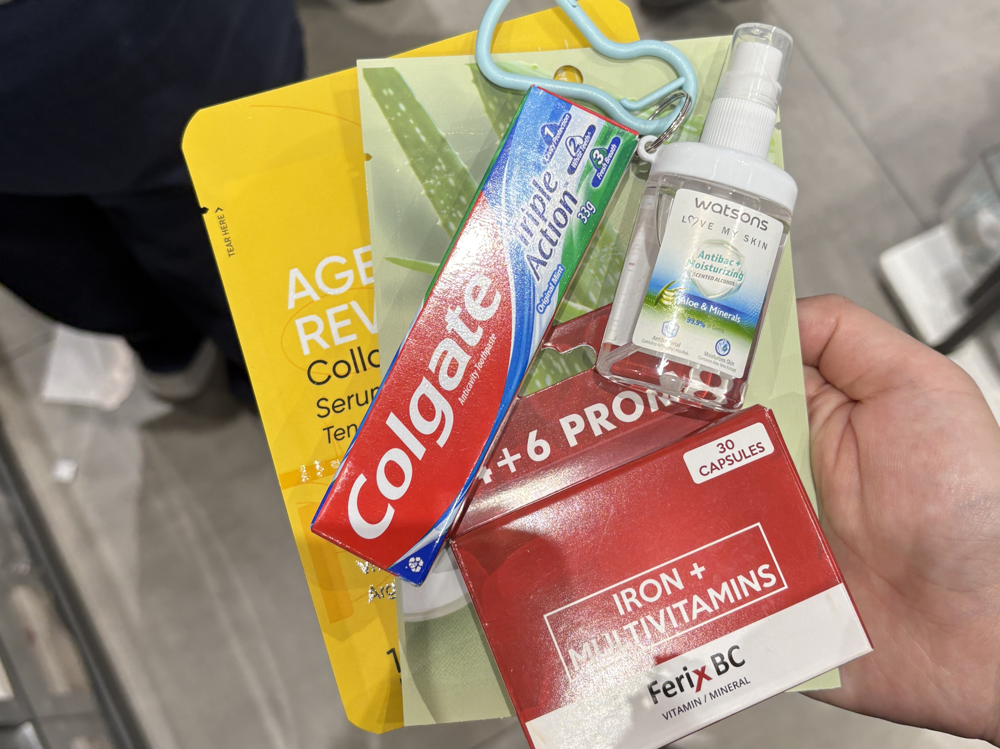
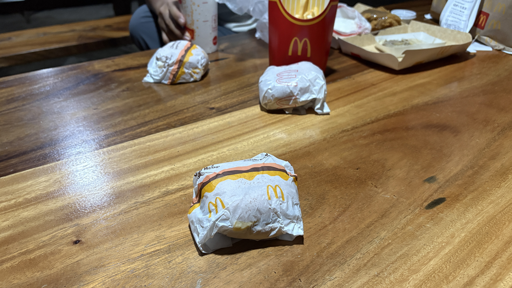

Some people gave me free snacks today!  
Apparently, they were handing them out to celebrate their church's upcoming 51st anniversary.  
What a lucky surprise!

I spent the morning exploring Baguio by myself. 
I went to Mirador Park, Burnham Park, and Baguio City Public Library.

I also got some ice cream at Burnham Park.  
It was not only tasty but also super cute!

After that, I had lunch with my Japanese and Chinese friends 🇯🇵🇨🇳.  
We had hot pot, but honestly... it wasn't for me.  
I think I'll stay away from hot pot in the Philippines from now on. 😂

Then we went to SM Mall and Baguio City Market.

I bought an iron supplement because I thought I might be low on iron.  
But when I checked the label after getting back to my room, I realized that each capsule contained 70 mg of iron!  
Japanese supplements usually contain around 10–20 mg, so 70 mg seemed like way too much for me.

Yeah... I decided not to take it. 😂

I also bought a new water bottle at SM Mall.  
It wasn't exactly the color I wanted, but it was close enough—and I actually like it!

Finally, I ate a cheeseburger that my Chinese friend gave me.  
My Chinese friends really do keep feeding me. 😂

  
Original

some people gave me a gift!
I expected it was a celebration day of the church.
I was lucky!

I went Mirador Park and Barnum Park and Public Library by my self in the morning.

I ate icecream at Barnum Park.  
it was good taste and looked so cute.

After that, I had lunch with my friends🇯🇵🇨🇳.
Hotpot is not good. I decided to not eat in the phillipines. 😂

I bought the bottle at SM Mall Baguio.
To be honest, I wanted another one, but I like it because it's similar shade.

We went to SM Mall and Baguio City Market.  

I bought iron supplement because I felt like lose on iron.
but I checked it when I went back to my room, the amount of iron is 70mg. Japanese supplement is usually include 10-20mg.
it was over three times of Japanese one.

I couldn't take it.

I bought a coffee bottle.
It wasn't what I wanted to, but it was similar colour!

I ate a cheese humburger which my Chinese frined gave me.

  
Fixed

Some people gave me some snacks!  
I guessed it was for a celebration at the church.  
I was lucky!

I went to Mirador Park, Burnham Park, and Baguio City Public Library by myself in the morning.  
I ate ice cream at Burnham Park.  
It tasted good and looked so cute.

After that, I had lunch with my Japanese and Chinese friends 🇯🇵🇨🇳.  
The hot pot wasn't very good.  
I decided not to eat hot pot in the Philippines again. 😂

We went to SM Mall and Baguio City Market.  
I bought an iron supplement because I felt like I might be low on iron.
However, when I checked it after I got back to my room, I realized that each capsule contained 70 mg of iron.  
Japanese iron supplements usually contain around 10–20 mg, so this one had more than three times as much iron.
I decided not to take it.  

I also bought a water bottle at SM Mall Baguio.  
To be honest, I wanted a different color, but I still like this one because it's a similar shade.

I ate a cheeseburger that my Chinese friend gave me.

