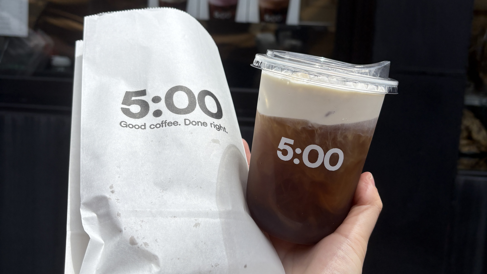
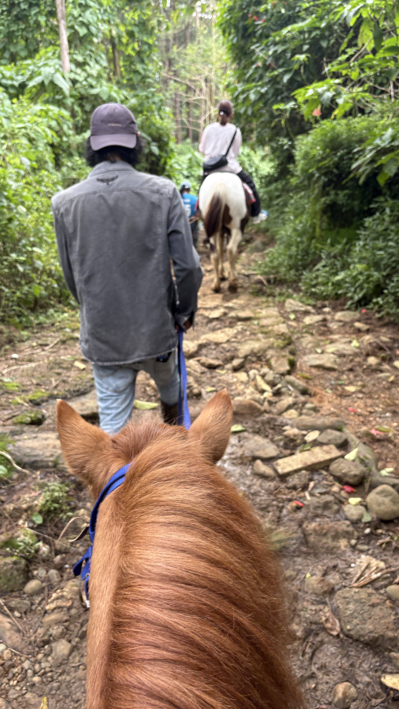
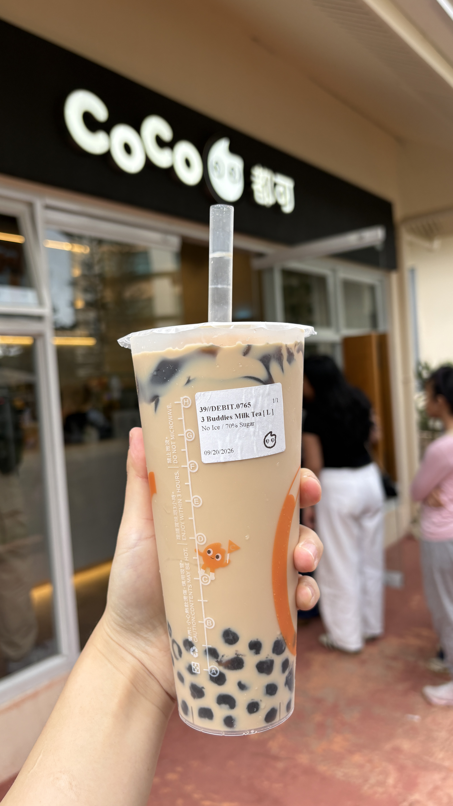
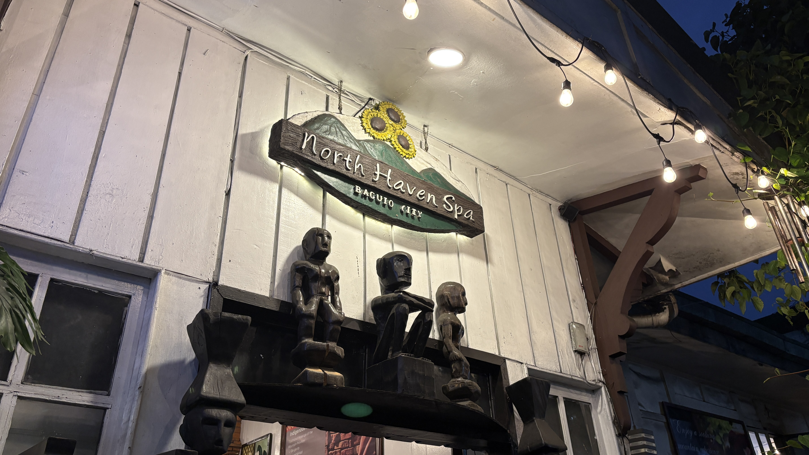
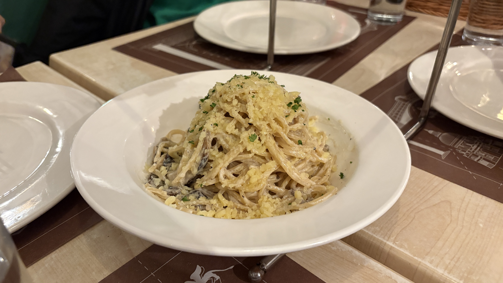
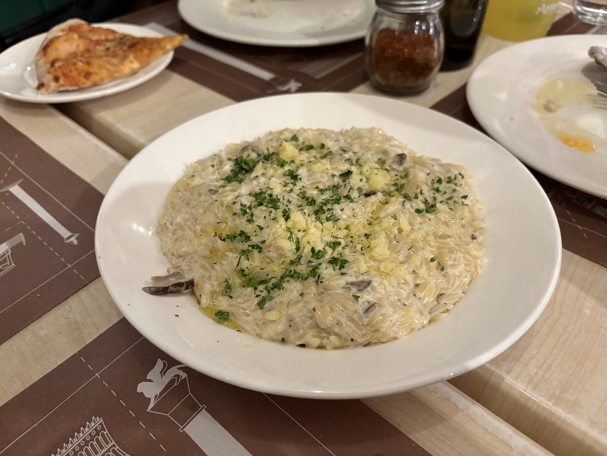
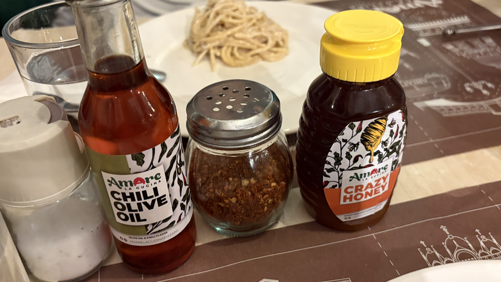
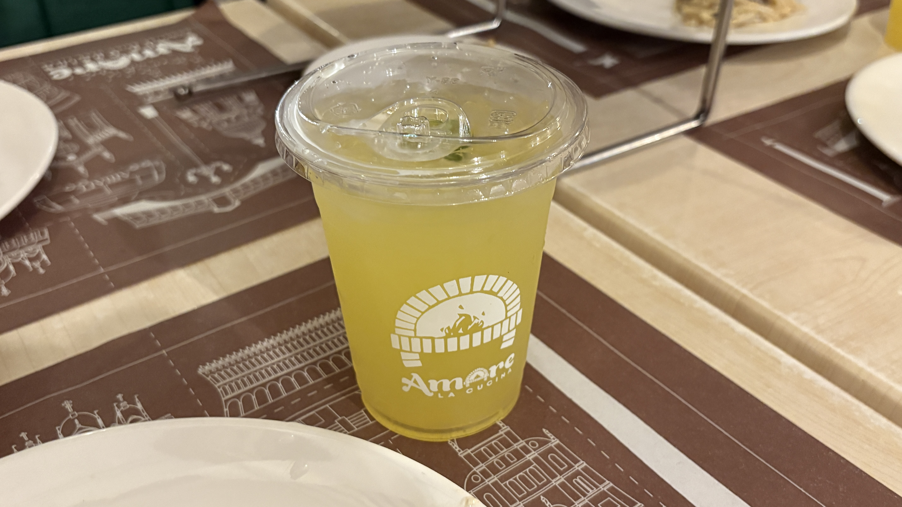
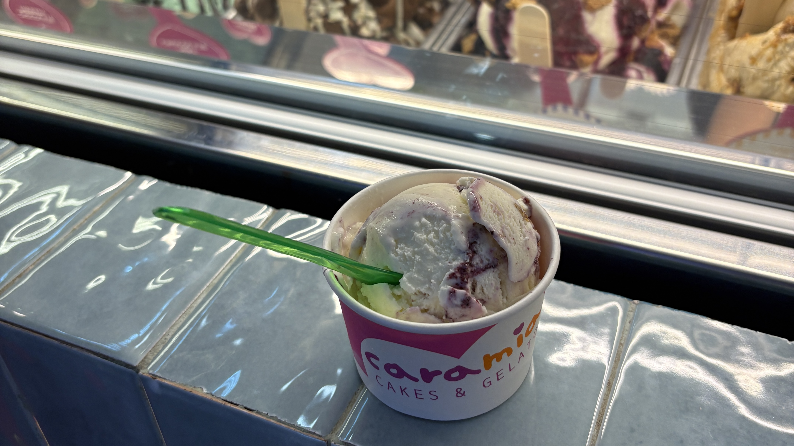

I started my morning with a coffee and a ridiculously huge cookie.  
The coffee was honestly the best one I’ve had in Baguio so far. ☕️

Later, I went horseback riding with my friends🇯🇵🇹🇼.  
I was a little nervous at first, but after just a few minutes, I started to get the hang of it.  
By the end, I was having so much fun!

I also tried CoCo bubble tea for the first time. 🧋  
I’d seen it in Shibuya before but had never actually tried it. I really liked it, so I’ll definitely get one next time I’m in Shibuya!

And yes... I went back to North Haven Spa for another massage.  
It’s just too good not to go back!

After that, I had dinner at Amare La Cucina Microtel, which my Reading teacher had recommended.  
The creamy truffle pasta was amazing, and the creamy risotto was just as good.  
The pizza, though, was just so-so. I had high hopes for it, so that was a little disappointing.

What a fun weekend!  
I got to do so many things, and I’m really glad we had some sunshine.  
The good weather only lasted until around 3 p.m., but I’ll take what I can get! ☀️

  
Original

I grabbed a coffee and a huge cockie in the morning.  
A coffee is the most dericios, so far.

I went riding a horse with mi friends🇯🇵🇹🇼.  
When I rode a horse at the first 3 minutes, I was getting used to riding a horse.  
I had a fun time in the end.

I drunk coco bubble tea for the first time.  
I like it.
I saw it in Shibuya, Tokyo, but I haven't tried it, so I'll drink it when I go to Shibuya.

I went to the Massage again.
North Heven Spa is really good.

After that, I had dinner at Amare La Cucina Microtel that my reading teacher recommended me.
Cream truffle pasta is so good, and cream risotto is also good.
Pizza is soso even I expected it is dericios.

This weekend was so fun!
I could do a lot of things.
I'm so happy the weather is sunny even good wheather is until 3PM.

  
Fixed

I grabbed a coffee and a huge cookie in the morning.  
The coffee was the most delicious one I’ve had so far.

I went horseback riding with my friends🇯🇵🇹🇼.  
During the first three minutes, I was a little nervous, but I quickly got used to riding the horse.  
I had a lot of fun in the end.

I drank CoCo bubble tea for the first time.  
I liked it!  
I had seen it in Shibuya, Tokyo, before, but I had never tried it, so I’ll get it again when I go to Shibuya.

I went to North Haven Spa for another massage.  
It’s really good!

After that, I had dinner at Amare La Cucina Microtel, which my Reading teacher recommended to me.  
The creamy truffle pasta was so good, and the creamy risotto was also delicious.  
The pizza was so-so, even though I had expected it to be delicious.

This weekend was so much fun!  
I got to do a lot of things.  
I’m so glad the weather was sunny, even though the nice weather only lasted until around 3 p.m.

