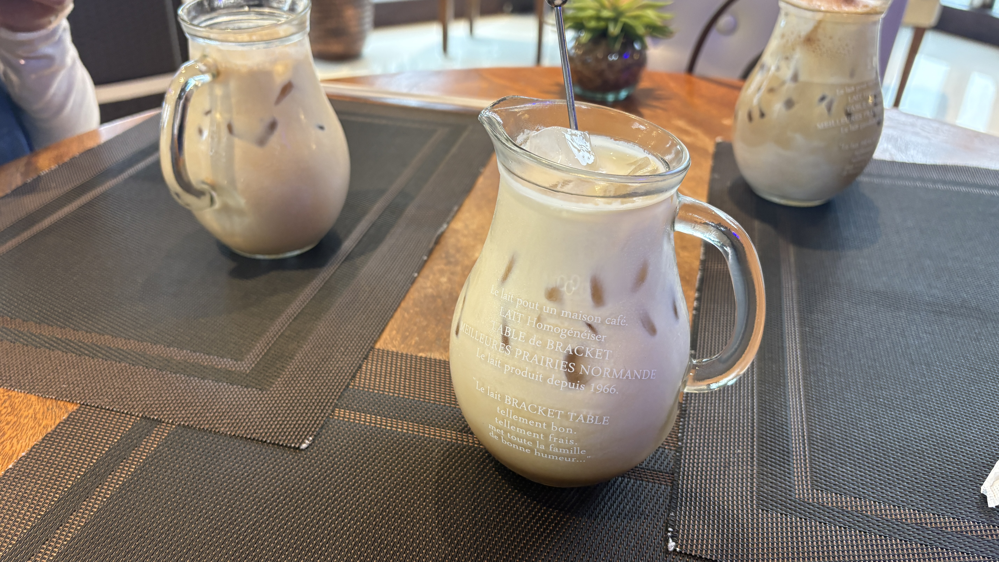
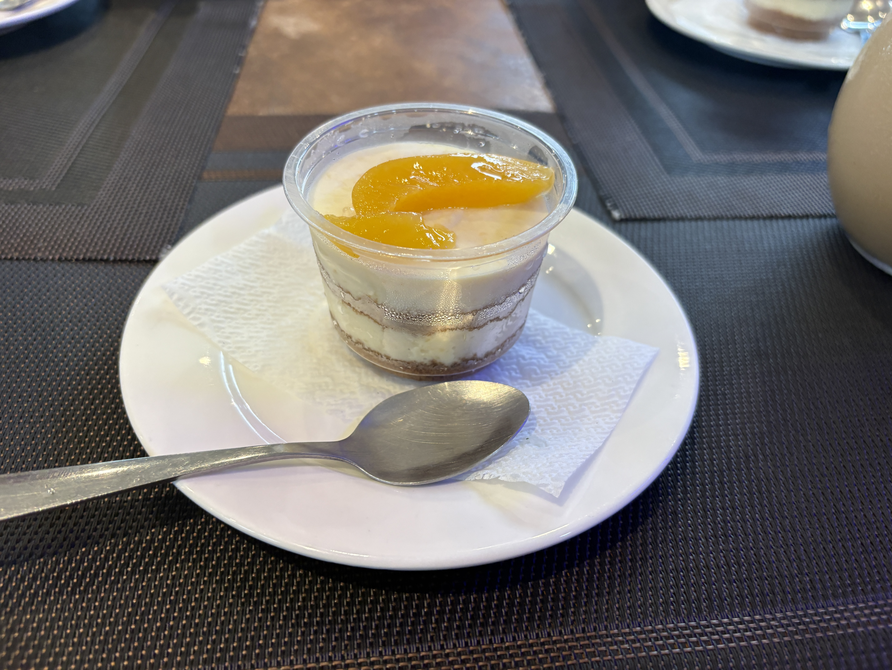

One of my Chinese classmates gave me a fried spring roll from a self-service food stand in front of the school, which is kind of like a "mujin hanbaijo" (unmanned shop) in Japan.

To be honest, I was worried that I might get a stomach ache, but luckily, I was okay.  
The fried spring roll had banana and ube inside.

My Chinese friends sometimes share food with me 😂.  
I'm so glad, and I think I should treat them to something next time!

My schedule changed, so I finished my classes one hour earlier than I did during the previous two weeks.  
That's why I went to Ritz Cafe with my Japanese friends.

We ordered some coffee and tiramisu.  
We were surprised by how huge the coffees were and by the Filipino-style tiramisu.

The tiramisu tasted different from what I'm used to in Japan. It was kind of frozen and didn't seem to have much coffee flavor.  
But I liked it anyway. It was different, but still delicious!

  
Meals

  
Original

Chinese student gave me a fried spring roll that we can buy in the front of school like "無人販売所" in Japan.

To be honest, I worried that I got a stomach ache, but I'm okey.  
It is bananas and ube inside fried spring roll.

My friends🇨🇳 sometimes give me some foods 😂.  
I'm so grad, but I shoud buy some food for taking my friends.

I changed my schedule because I finished classes 1 hour early than previous 2 weeks.   
That's why I went to Ritz Cafe with my friends🇯🇵.

We orderd some coffee and tiramisu.  
We are surprised huge coffee and phillipino style tiramisu.  
Tiramisu is different taste in Japan which is kind of frozen and doesn't used cofee, I guess.
but I like it as that was good.

  
Fixed

A Chinese student gave me a fried spring roll from a self-service food stand in front of the school, which is kind of like a "mujin hanbaijo" (unmanned shop) in Japan.

To be honest, I was worried that I might get a stomach ache, but I was okay.  
The fried spring roll had banana and ube inside.

My Chinese friends sometimes give me some food 😂.  
I'm so glad, but I should buy some food for them too.

My schedule changed, so I finished my classes one hour earlier than I did during the previous two weeks.  
That's why I went to Ritz Cafe with my Japanese friends.

We ordered some coffee and tiramisu.  
We were surprised by how huge the coffees were and by the Filipino-style tiramisu.

The tiramisu tasted different from the tiramisu in Japan.  
It was kind of frozen and didn't seem to have coffee in it.  
But I liked it because it was good!

