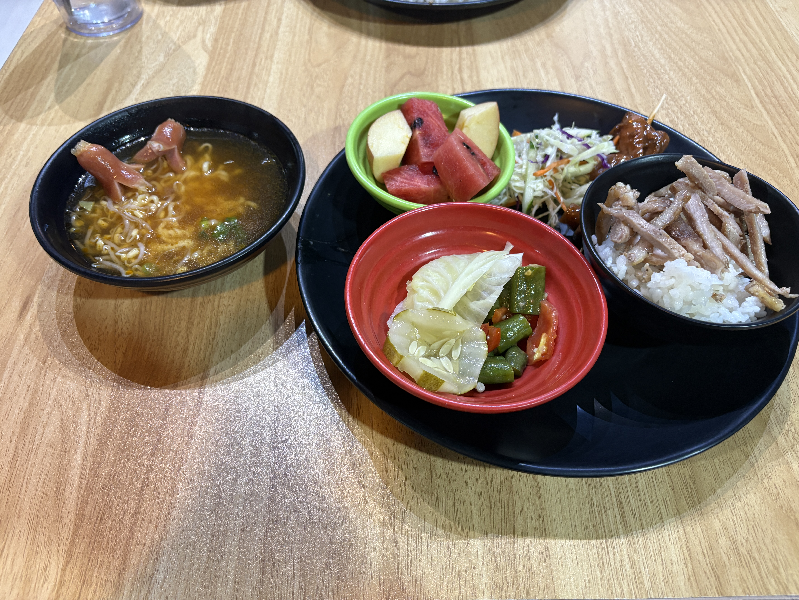
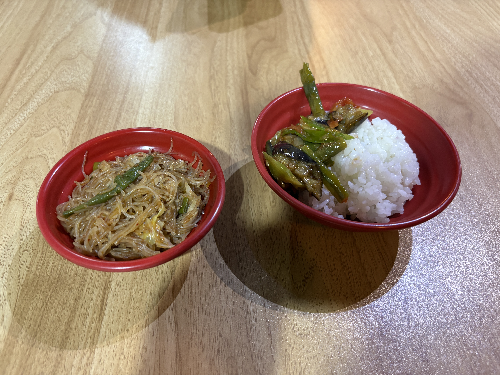

I studied at Form Coffee with two Japanese friends and a Taiwanese friend.

The cafe was so nice, with stylish decor and great food and drinks. 
 I could focus much better there than at school.

I immediately thought, “I wanna come here every day!”

It’s definitely my favorite cafe in Baguio so far.  
I think I’ve found my new study spot!

  
Meals

  
Original

I studied at Form coffee with two Japanese friends and a Taiwanese friend.  
It was gooood place which has fancy decoration, food and beverage.  
I can focus on studying more than school.

I thought that I wanna come here everyday!  
It is my most favorite cafe in Baguio, so far.

  
Fixed

I studied at Form Coffee with two Japanese friends and a Taiwanese friend.

It was a really nice place with fancy decorations, food, and drinks.  
I could focus on studying better than I could at school.

I thought, “I wanna come here every day!”

It’s my favorite cafe in Baguio so far.

