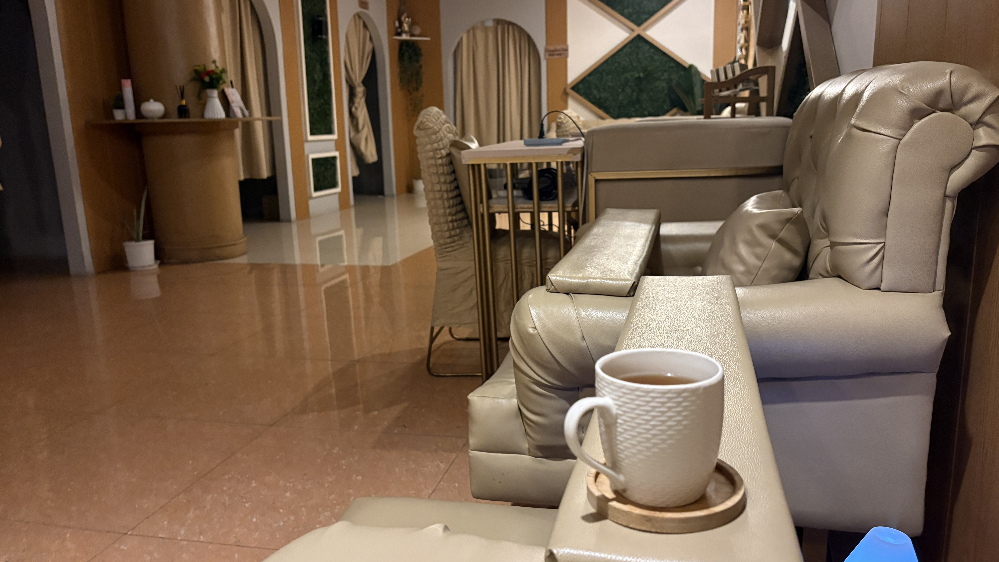

I was so tired today... actually, I'm tired every day 😂.

I ordered bubble tea on Grab during my lunch break.  
It was way too sweet, but unfortunately, there was no option to adjust the sugar level. Oh well...

I skipped dinner and went to a massage place called "Spa De Iloko Baguio City Branch."  
It was honestly the best massage I've had in Baguio so far!

The price was surprisingly affordable, especially since it included a head, body, and foot massage.  
Cheap price, great quality — definitely a win.

I already wanna go back!

And then... I ate Buldak 😂.

Massage for my health, Buldak for my soul.

  
Meals

  
Original

I was so tired today (no, everyday😂).

I ordered a bubble tea on Grab during lunch break.  
It was too sweet, but I coudln't change sugar level... I have no choice...

Today, I skipped finner and I went to the Massage called "Spa De Iloko Baguio City Branch".  
It was really nice place and my best Massage in Baguio, so far.  
It is low price include head, body and foot, but it is high quality.

I wanna go there again!

I ate Buldak.  
Today was healthy & junky day.

  
Fixed

I was so tired today (no, every day 😂).

I ordered bubble tea on Grab during my lunch break.  
It was too sweet, but I couldn't change the sugar level, so I had no choice...

Today, I skipped dinner and went to a massage place called "Spa De Iloko Baguio City Branch."  
It was a really nice place and the best massage I've had in Baguio so far.  
It was affordable and included a head, body, and foot massage, but the quality was really good.

I wanna go there again!

I ate Buldak afterward.  
Today was a healthy-and-junk-food kind of day 😂.

