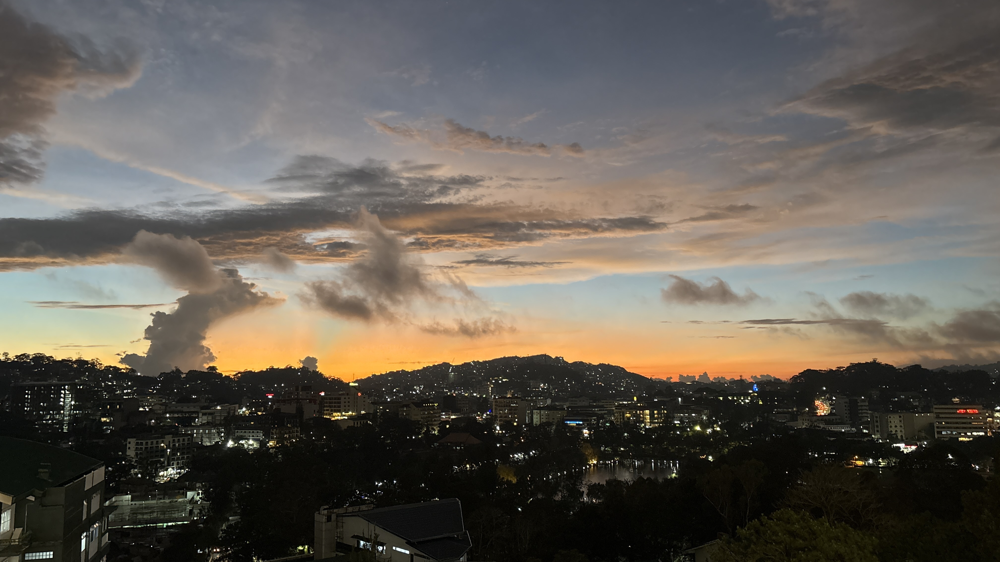
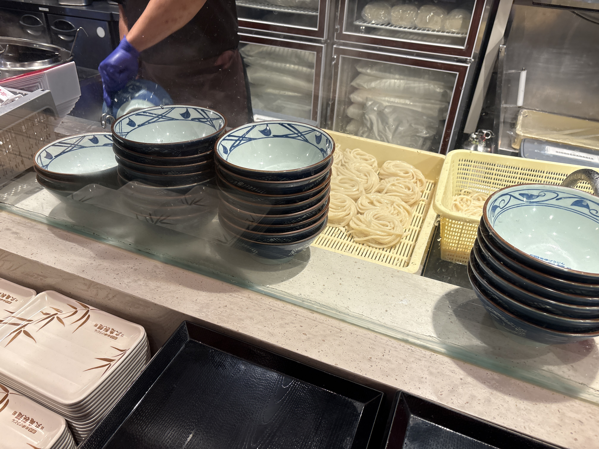
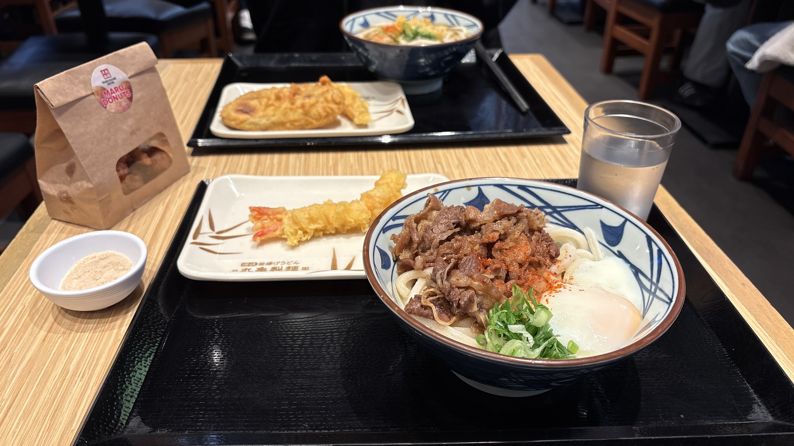
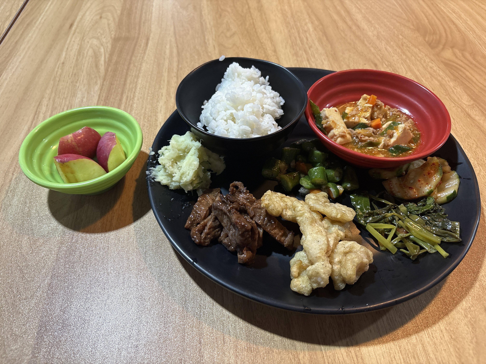

I left Baguio for Banaue by bus at 7:30 p.m.

Before setting off, I had udon at Marugame Seimen.  
It was surprisingly similar to the udon in Japan.  
I ordered niku udon this time, but I would love to try a lighter udon with dashi broth next time.

The bus terminal was a little narrow and old-fashioned, but that somehow made the journey feel even more adventurous.  
Banaue had been on my travel wish list for a long time, so I could hardly contain my excitement.

  
Meals

  
Original

I left From Baguio to Banaue at 19:30 by bus.

Before that, I ate Udon at Marugame-seimen.  
It was almost similar, but I had Niku-udon so I'll tray another Udon with dashi.

I went to the bus tarminal for taking bus.  
but I feel like there is narrow and old.

I would love to Banaue.  
I was so excited.

  
Fixed

I left Baguio for Banaue by bus at 7:30 p.m.  
Before that, I ate udon at Marugame Seimen. It was quite similar to the udon in Japan, but I had niku udon, so I would like to try another kind of udon with dashi broth next time.  
I went to the bus terminal to catch the bus, but it felt narrow and old.  
Banaue was a place I had wanted to visit for a long time, so I was very excited.

