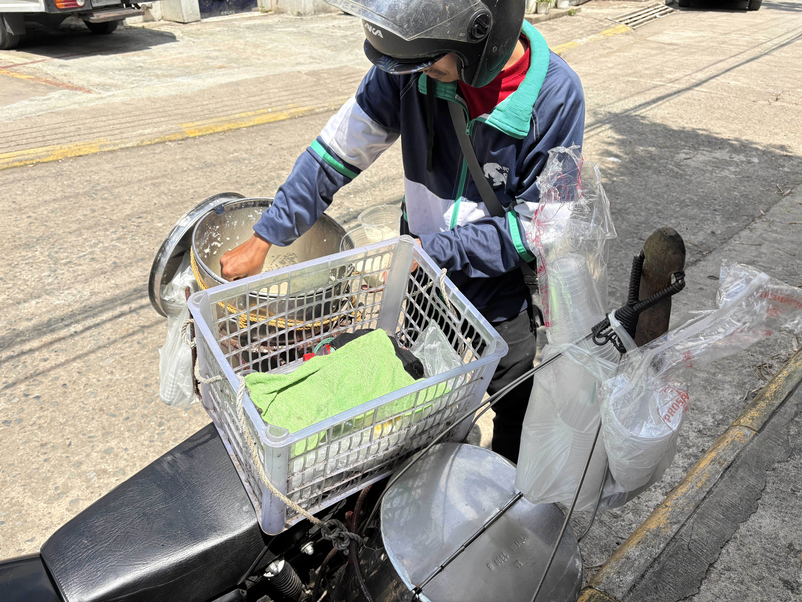
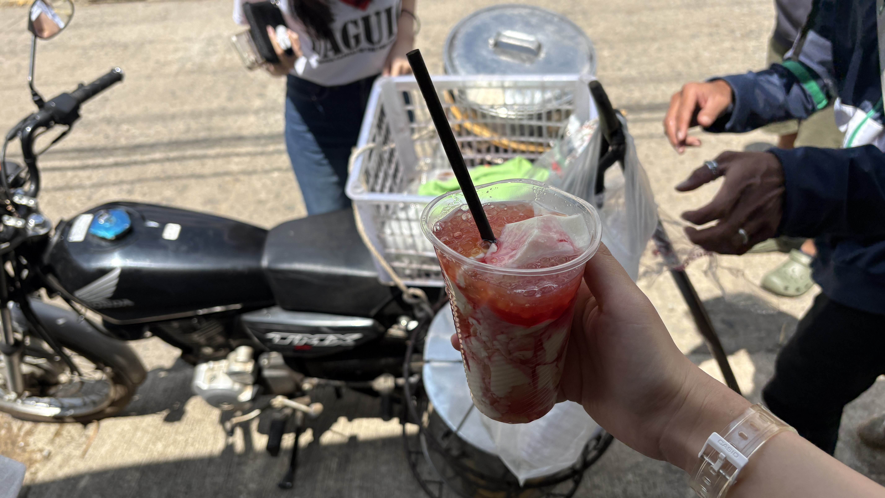
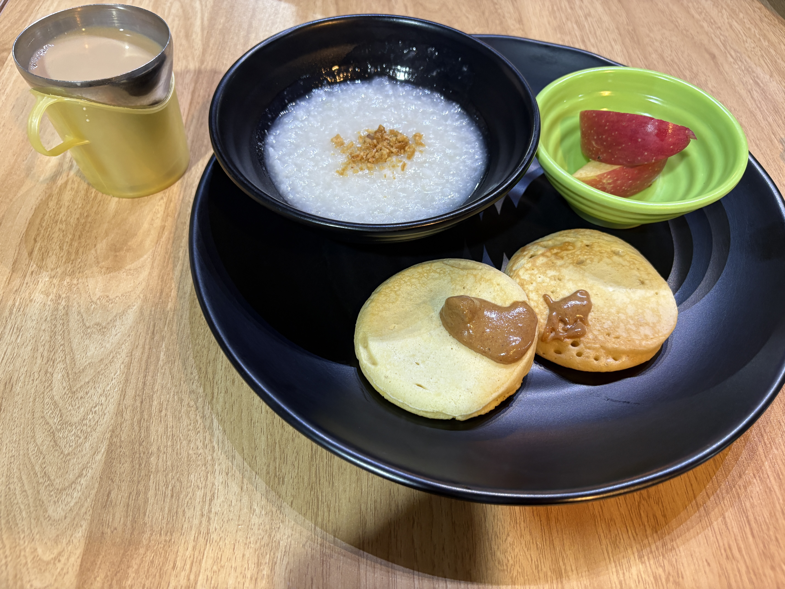
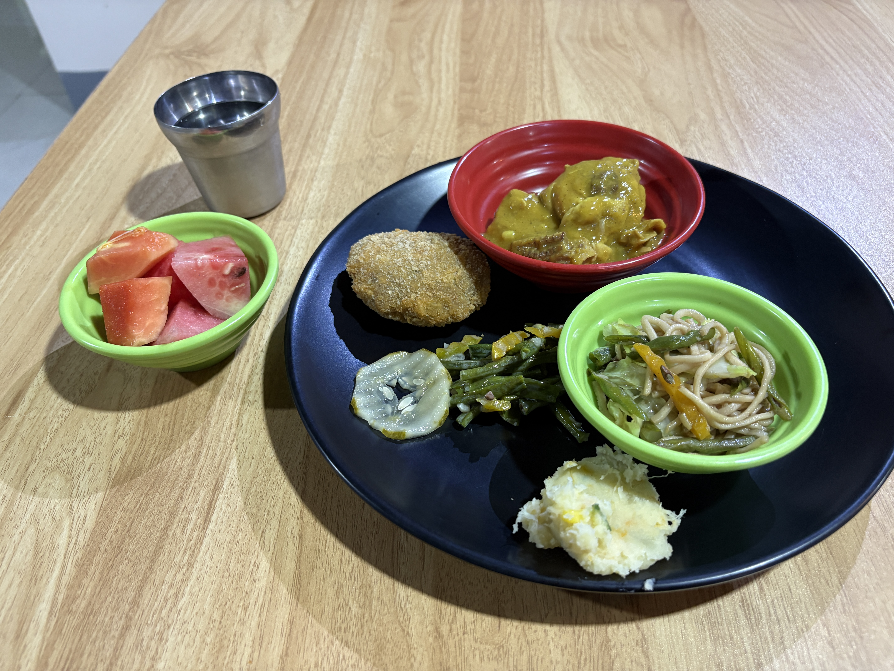

I tried strawberry taho for the first time today!

It was actually less sweet than I expected.  
The tofu itself was pretty plain, and most of the sweetness came from the strawberry sauce.

I asked for less sauce because I thought it might be too sweet... but apparently, I underestimated my sweet tooth 😂  
Next time, I'm definitely getting more sauce!

After classes, we sat around the table in front of the campus and chatted until 10 p.m.

I really love spending time there.  
It's such a simple thing, but it's become one of my favorite parts of life here.

  
Meals

  
Original

I ate strawberry taho at the first time!  
It was not too sweet that I expected.  
Tofu was natural taste without sugar.  
Strawberry source was only sweet.

I ordered less source... I wanted to try again because I actually have a sweet tooth.

After classes, we were chatting at the table in the front of the campus until 22 p.m.

I love spending time there.

  
Fixed

I tried strawberry taho for the first time!  

It wasn't as sweet as I expected.  
The tofu itself had a natural taste without any sugar, and only the strawberry sauce was sweet.

I asked for less sauce, but I actually wanted to try it again because I have a sweet tooth 😂

After classes, we chatted at the table in front of the campus until 10 p.m.

I love spending time there.

