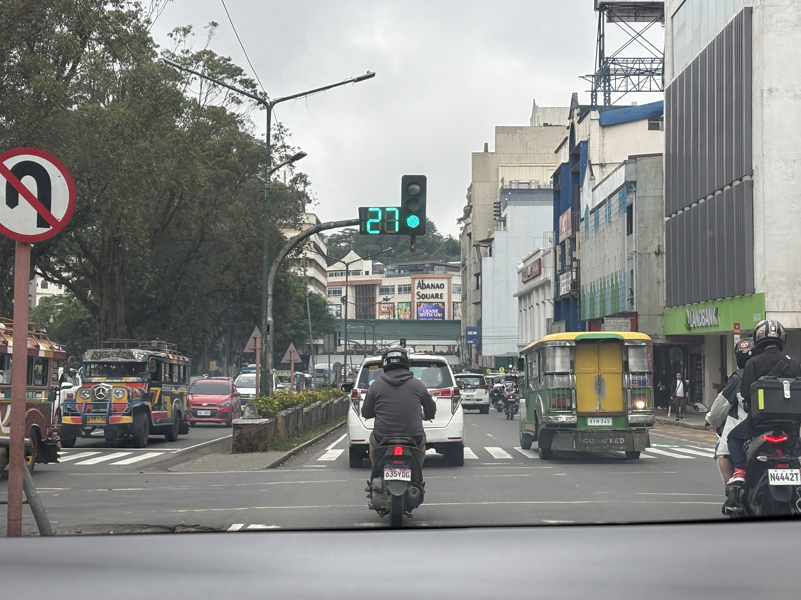
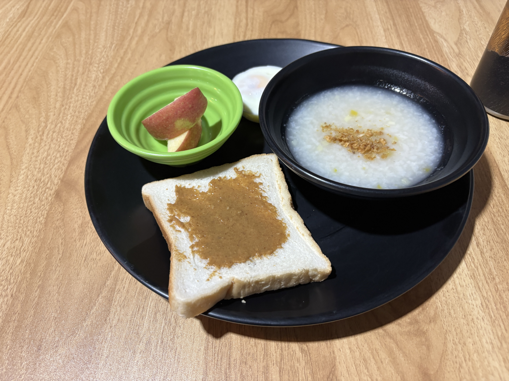
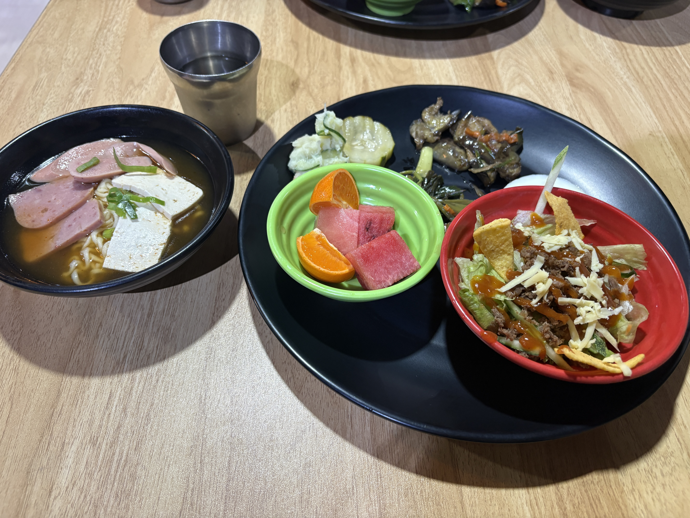

I took another mock test today, and... it was sooo bad 😭

I honestly felt like I couldn't do anything properly.
Definitely not my best day.

On the way out, though, I noticed something random: Baguio actually has traffic lights!

For some reason, I had assumed there weren't any traffic lights in the city, so I was weirdly surprised 😂

After that, I went to a bakery in Baguio for the first time.

There were so many different kinds of bread, cakes, and pastries that it was hard to choose.

Of course, I still managed to buy a few 😂

  
Meals

  
Original

- mock test
  - sooo bad
  - I coudn't do that.
- I noticed there are some signals in Baguio.
  - I expected Baguio city doesn't have any signals.
- it's my first time to go to the bakery in Baguio.

  
Fixed

I took a mock test today.

It was sooo bad.
I couldn't do well at all.

I also noticed that there are traffic lights in Baguio.

I had thought that Baguio City didn't have any traffic lights, so I was a little surprised.

After that, I went to a bakery in Baguio for the first time.

There were many kinds of bread, cakes, and pastries.

I bought a few things to try.

