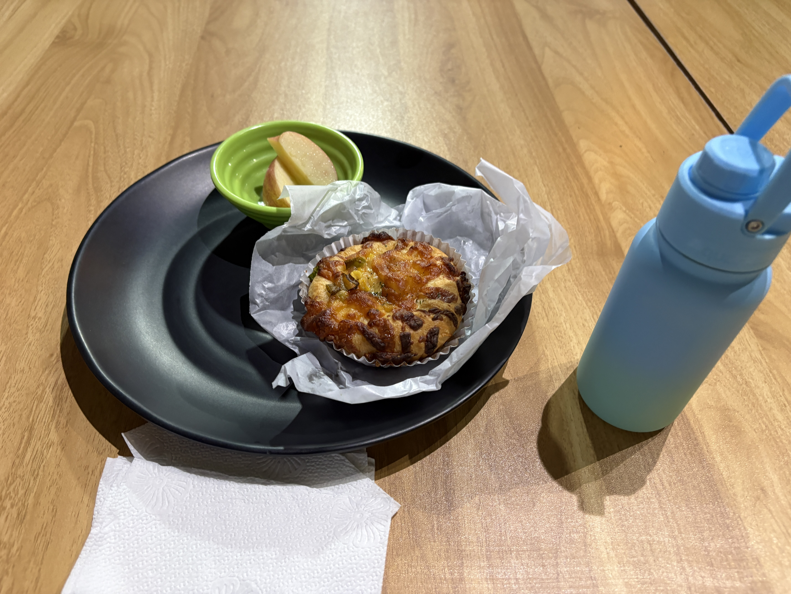
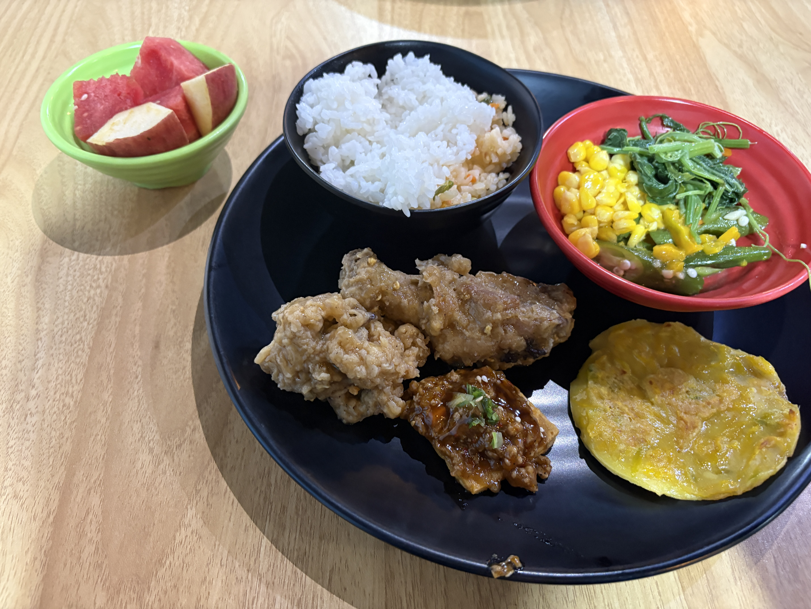
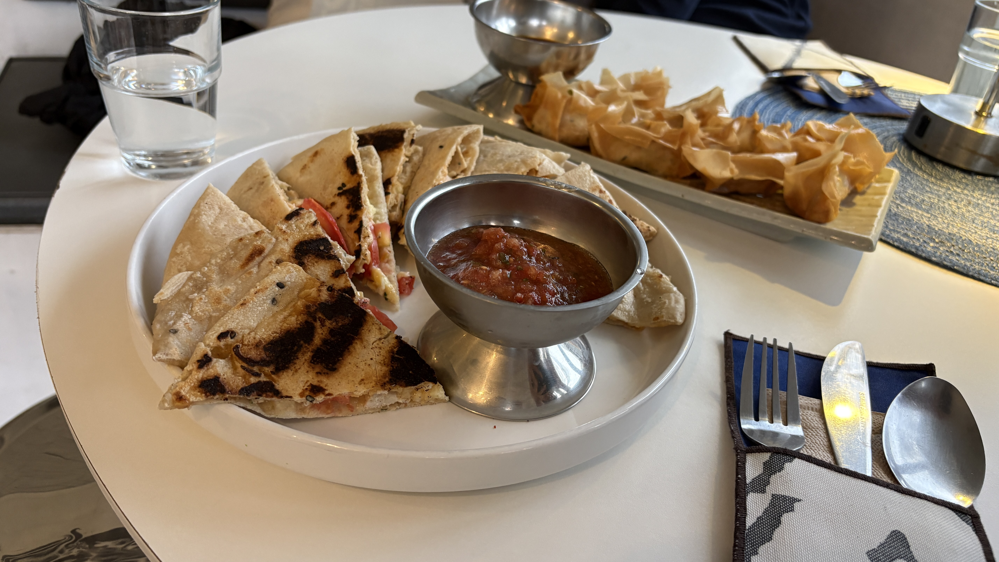
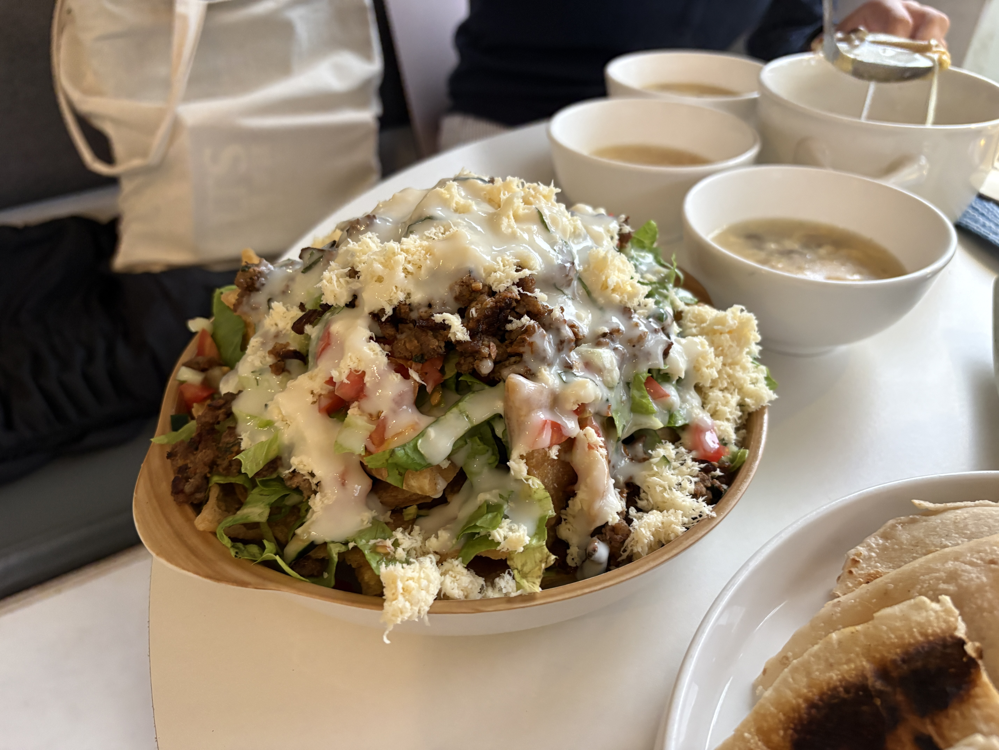

I had dinner at Cafe Anjela today, and the food was amazing too!

I also got my IELTS mock test results.  
They weren't bad at all, although I was hoping to get an overall score of 6.0.

I was sooo close! If my Listening score had been 6.0, I could have gotten an overall 6.0 😭  
But on the bright side, I got a 5.5 in Speaking for the first time!

I think my main weaknesses are spelling and vocabulary, as well as coming up with answers quickly in the Speaking test.

I already have an IELTS vocabulary app, so it's time to put it to good use 💪

  
Meals

  
Original

- at cafe anjela for dinner
  - foods are also amazing
- my result of mock test is not bad
  - but I wanted to get 6.0
  - if Listening score is 6.0, I can get OA 6.0!
  -  it is first time to get 5.5 speaking score!
- my weakness is spelling and vocab, also responce quickly in speaking
  - I have IELTS vocab app, so (使い倒したい)

  
Fixed

I went to Cafe Anjela for dinner.  
The food was amazing too!

I got the results of my IELTS mock test today.  
My result wasn't bad, but I wanted to get an overall score of 6.0.

If my Listening score had been 6.0, I could have gotten an overall score of 6.0!  
Also, it was my first time getting a 5.5 in Speaking!

I realized that my weaknesses are spelling and vocabulary, as well as responding quickly in the Speaking test.

I have an IELTS vocabulary app, so I want to make the most of it!

