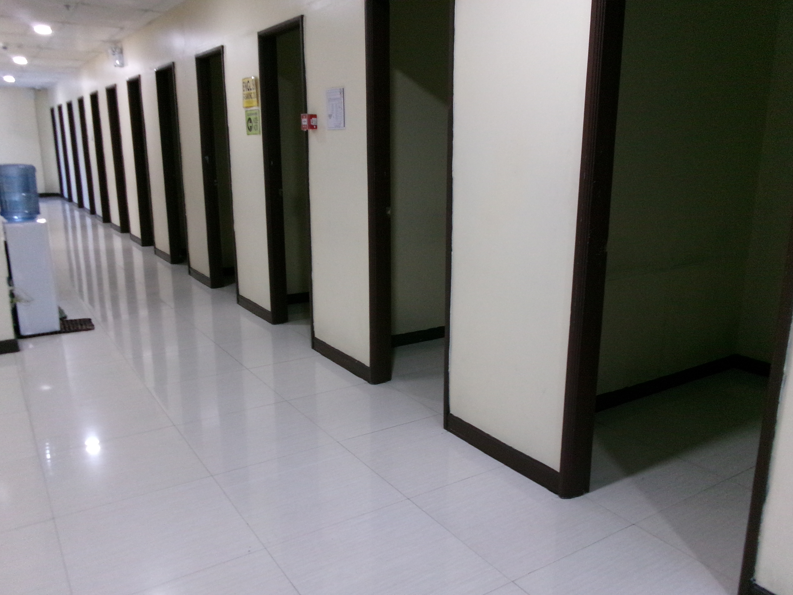
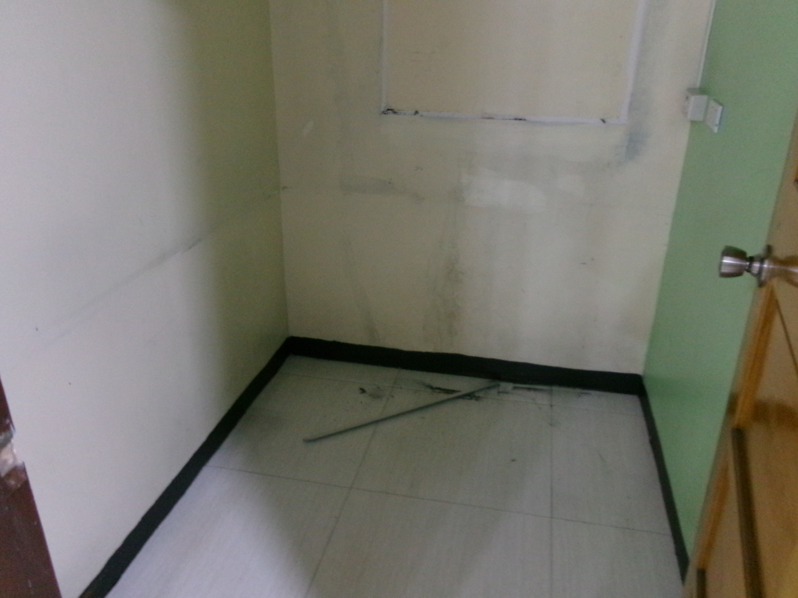
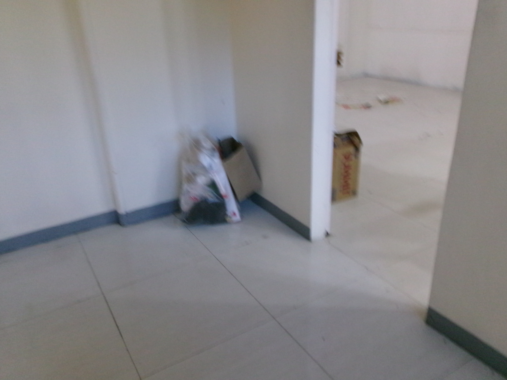
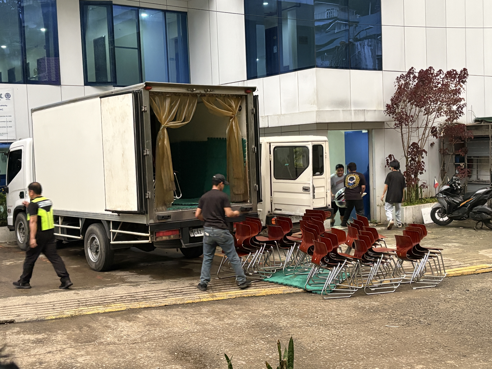
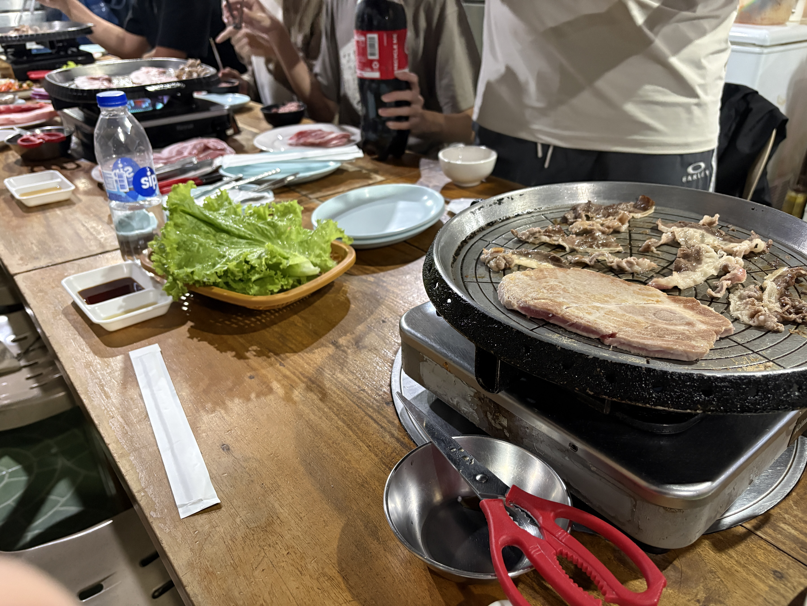
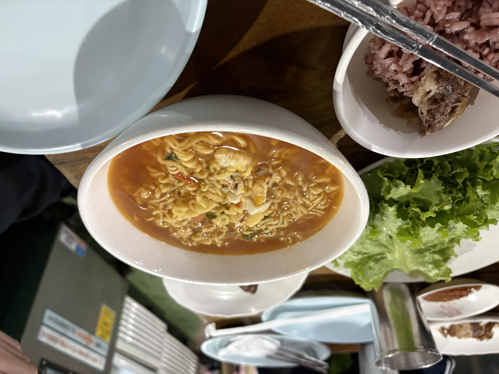
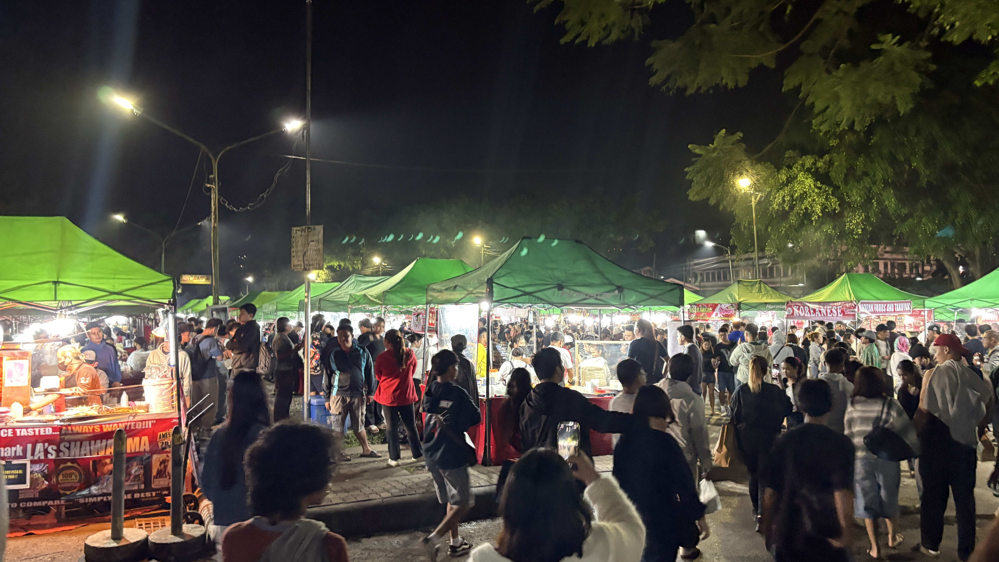
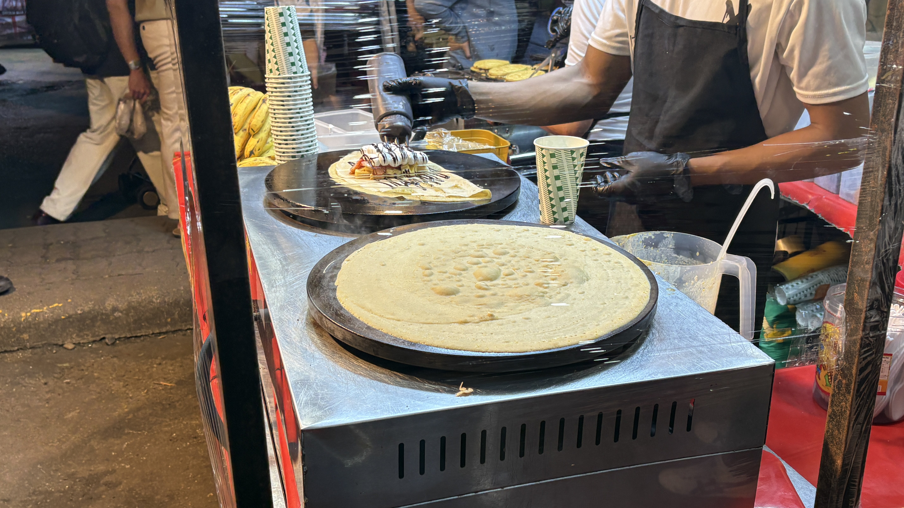
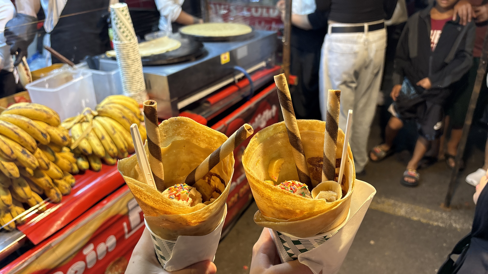

Today was the last day for one of my Japanese and one of my Taiwanese friends.  
I already miss them ☔️

We made so many good memories together, though, and I'll definitely cherish them 🤍

The IELTS Campus is getting emptier and emptier as furniture and other things are being moved out.  
Seeing it like this really made me realize that a whole month has already passed.  
I can't believe how fast time has gone by.

We had dinner at a Korean restaurant called JIN JOO.  
The samgyeopsal tasted pretty similar to what I'm used to eating in Japan, which was nice and comforting.

Later, we went to the night market.  
I somehow ended up buying three more pieces of clothing... apparently I'm still finding new ways to add to my luggage 😂  
But I couldn't resist because everything was so cheap!  
Two shirts were only 75 PHP each, and a pair of trousers was just 350 PHP.

We also got crepes for dessert.  
They looked amazing and, thankfully, tasted just as good!  
Mine came with ice cream and colorful sprinkles - basically happiness wrapped in a crepe 🍦✨

  
Original

Today, one Japanese and one Taiwanese frineds was last day.
I really miss them already☔️

But I made a lot of cherrish memory🤍

IELTS Campus is getting lower funitures and stuffs.  
I felt so early that it benn passed already one month.

We had dinner at Korean restaurant called JIN JOO.

Later, we went to the night market.
I ended up buying three clothes...but it was so cheap because two shirts was 150 PHP and one trouther was 350 PHP!

We ate a clape.
it looked so good and actually it was tasty!!
I am happy it with icecream and coloful spray.

  
Fixed

Today was the last day for one of my Japanese friends and one of my Taiwanese friends.  
I already miss them ☔️

But we made a lot of precious memories together 🤍

The IELTS Campus is getting emptier because there is less furniture and fewer things around.  
I can’t believe that one month has already passed. It went by so fast.

We had dinner at a Korean restaurant called JIN JOO.  
The samgyeopsal tasted pretty similar to what I’m used to eating in Japan.

Later, we went to the night market.  
I ended up buying three pieces of clothing, but they were so cheap!  
Two shirts were 150 PHP each, and one pair of trousers was 350 PHP.

We also ate crepes.  
They looked so good, and they were actually really tasty!  
Mine had ice cream and colorful sprinkles.

