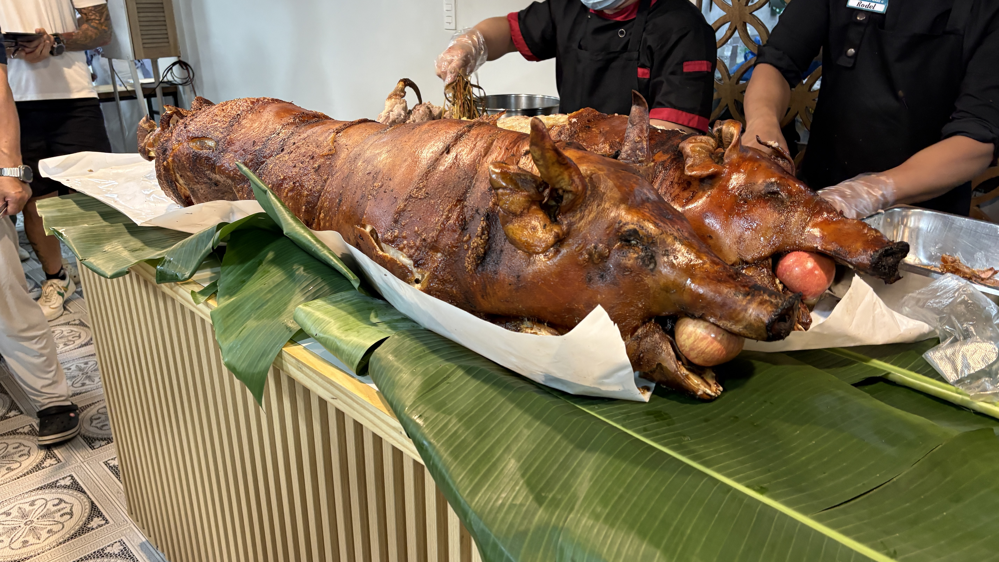
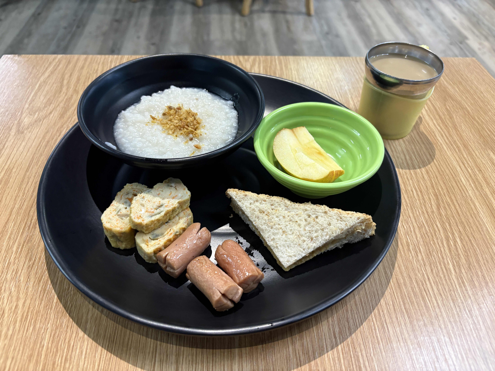
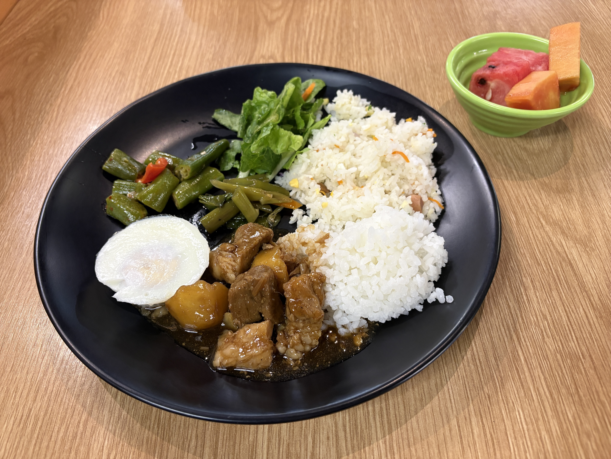
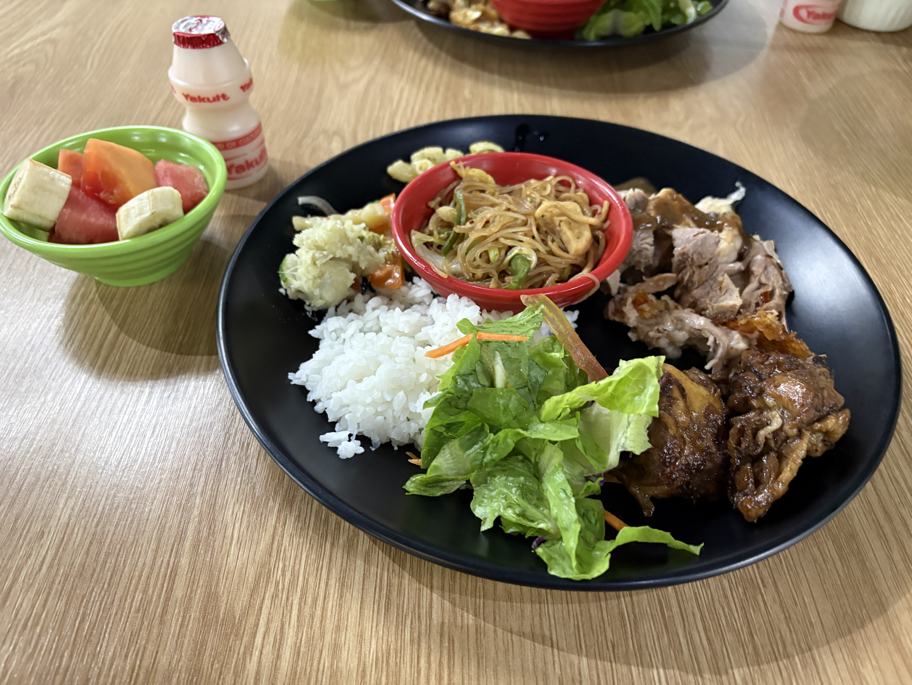

Today's dinner at the canteen was lechon!  
And we even got Yakult!

Dinner felt extra special today.  
It was really tasty and definitely different from what we usually have.

I had no idea what the special occasion was, but I wasn't complaining 😂  
I'd never tried lechon before, so I guess I got pretty lucky!

  
Meals

  
Original

Today's dinner menu at the canteen was lechon!  
I also got Yakult!

I felt today's dinner was tasty and definitely different from other day's one.

I didn't know why the dinner was such special.  
I was lucky because I've never tried lechon😆

  
Fixed

Today's dinner at the canteen was lechon!  
I also got a Yakult!

Today's dinner was really tasty and definitely different from the meals we usually have.

I didn't know why dinner was so special today.  
I was lucky because I'd never tried lechon before 😆

