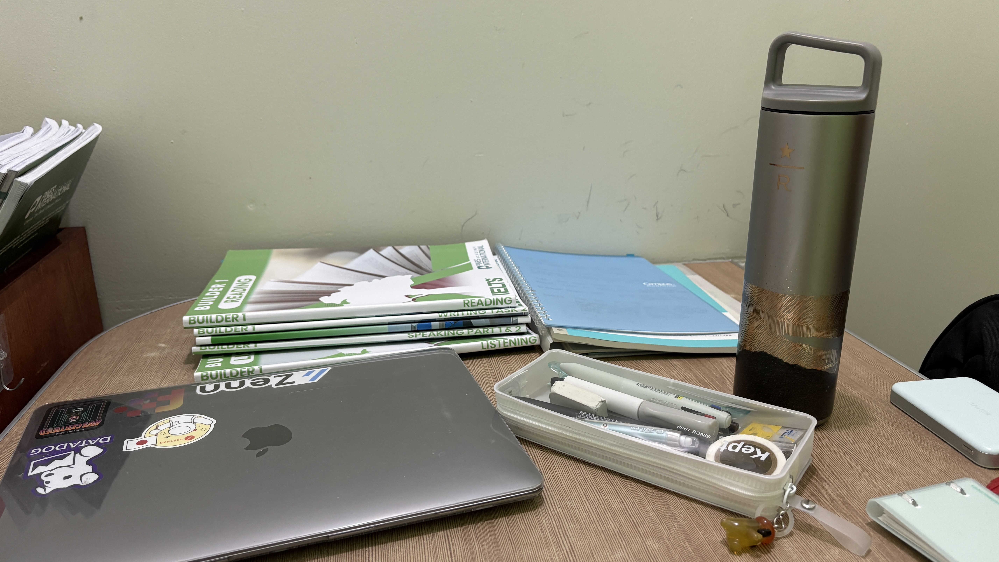
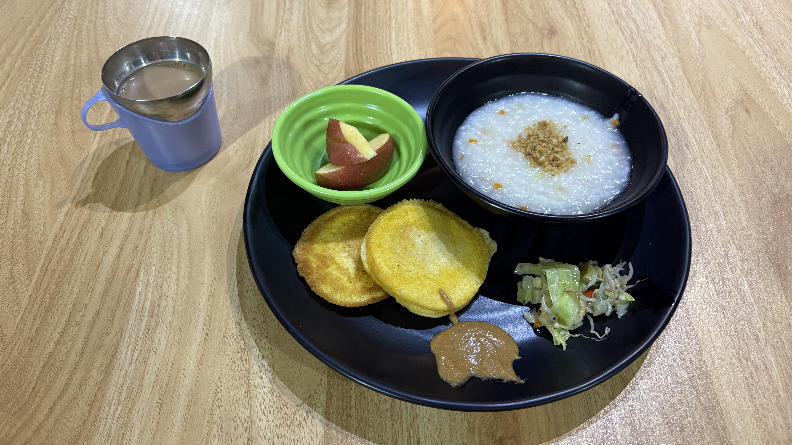
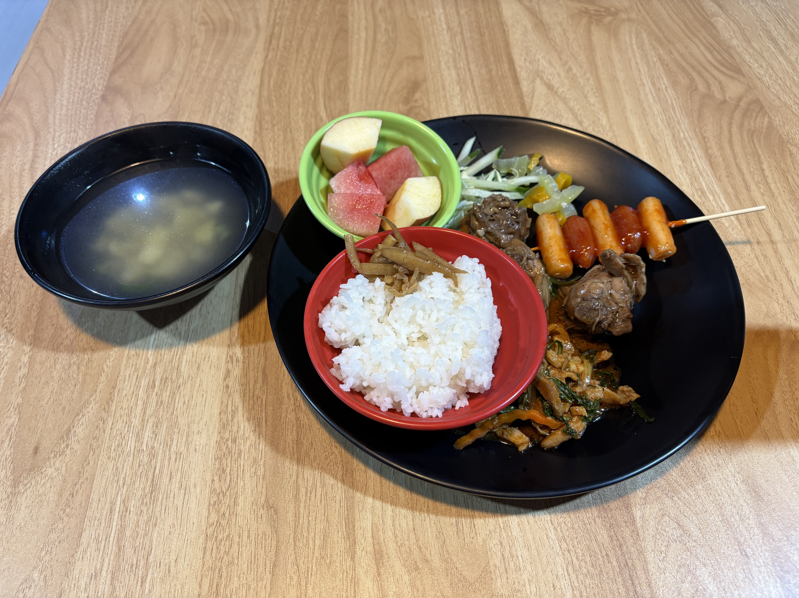
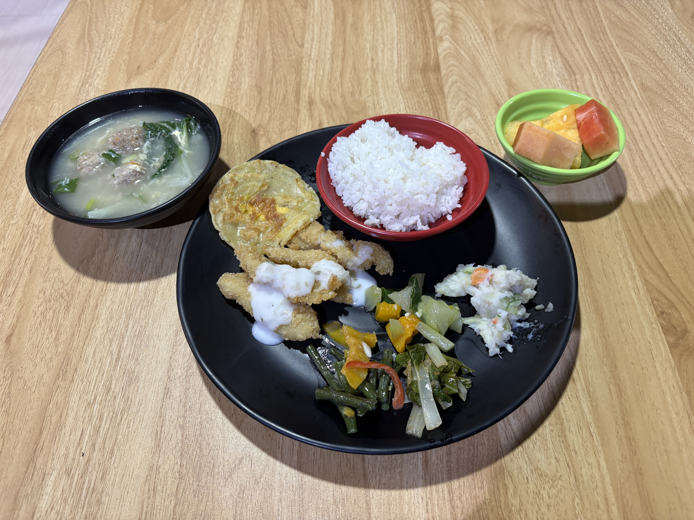

My roommate, Wendy, lent me her Dyson hair dryer, and wow, it dries my hair so much faster than mine.  
I’m really glad she let me borrow it!

Lately, I feel like there just aren’t enough hours in the day.  
I want to learn more vocabulary, but I’m still struggling to manage my study time effectively.

I also feel like I’m not getting enough iron, so I’m going to buy an iron supplement this weekend.

  
Meals

  
Original

my roommate, Wendy, let me a Dyson dryer.  
I’m glad that it takes shorter time than my dryer.

I feel like I don’t have enough time.  
I want to lean more vocabularies but it is difficult for me to control studying.

I feel like I’m getting enough iron.  
I’m gonna buy iron supplement this weekend.

  
Fixed

My roommate, Wendy, lent me her Dyson hair dryer.  
I’m glad that it takes less time to dry my hair than with my own dryer.

I feel like I don’t have enough time.  
I want to learn more vocabulary, but it’s difficult for me to manage my study time.

I feel like I’m not getting enough iron.  
I’m going to buy an iron supplement this weekend.

