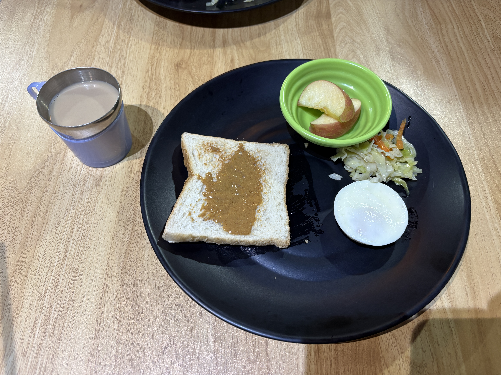

The school manager told me some good news today: I don’t have to move to a four-bed room after all!  
I can stay in my current three-bed room without paying any extra accommodation fees.

I had originally booked a three-bed room for two weeks and a four-bed room for the next two weeks to save some money.  
But honestly, I wanted to stay in the same room for the whole month, so this worked out perfectly.  
Lucky me!

<video controls src="Outdoor space at PINES.MOV" title="Outdoor space at PINES"></video>

We also had a power outage for about three minutes today.

<video controls src="A short power outage at PINES.MOV" title="A short power outage at PINES"></video>

Recently, I’ve noticed that I can catch more English words than before when listening to podcasts and watching vlogs.  
I still can’t understand everything they say, but I feel like I’m making progress little by little.

I hope my listening skills are actually improving!

  
Meals

  
Original

The school manager announced me that I do not have to move 4 bed room and I can still stay at 3 bed room.  
I selected 3 bed room in 2 weeks and 4 bed room in 2 weeks, but I do not have to pay difference accommodation fee.  
I'm lucky.  
To be honest, I wanted to save money, but I wanted stay at  same room for 1 month.

It did power outage in approximately 3minutes.

I rearised that I can hear more words in English than before while listening a podcast and vlog, but I don't understand whole what she say.

I hope My listening skill is getting improve!

  
Fixed

The school manager told me that I don’t have to move to a four-bed room and that I can stay in my three-bed room.

I had originally chosen a three-bed room for two weeks and a four-bed room for the following two weeks, but I don’t have to pay the difference in accommodation fees.

I’m lucky!

To be honest, I wanted to save money, but I also wanted to stay in the same room for a whole month, so this worked out perfectly.

There was a power outage for approximately three minutes.

I realized that I can understand more English words than before when I listen to podcasts and watch vlogs.  
However, I still can’t understand everything they say.

I hope my listening skills are improving!

